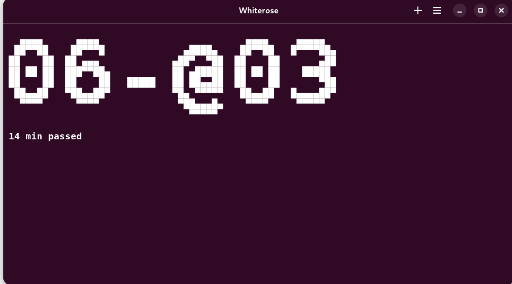
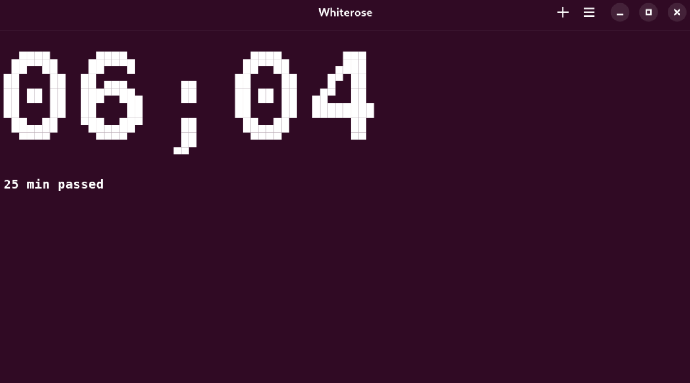
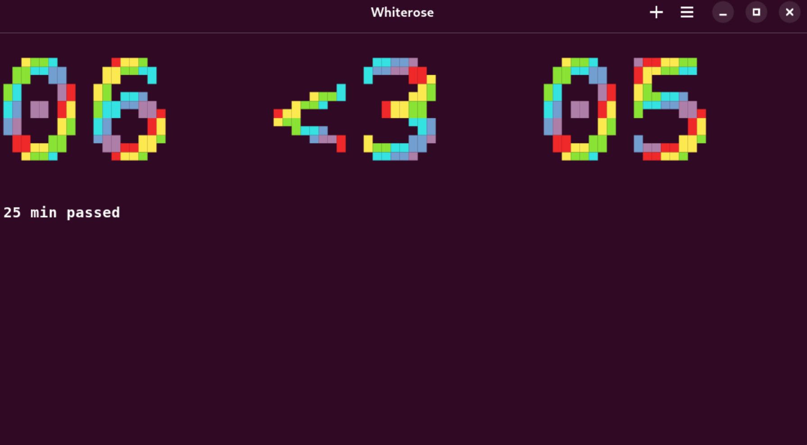
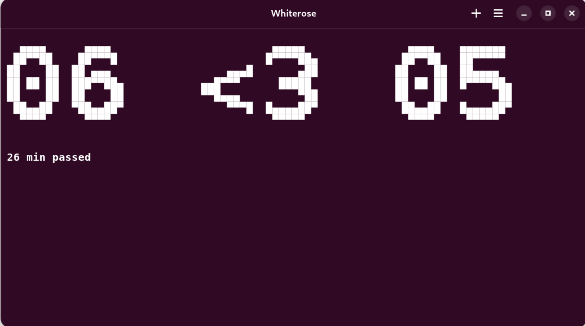

# White Rose Terminal Clock

A colorful, ASCII-art clock for your terminal, inspired by the enigmatic Whiterose's digital watch from Mr. Robot.





Features:
- Real-time HH:MM display (customizable :3) 
- Rainbow colors for a subtle "geek chic" vibe 🌈
- Minimal dependencies: Bash + toilet + sox

Perfect for terminal aesthetics lovers, Mr. Robot fans, or anyone who enjoys a stylish ASCII clock in their shell.

Usage:
```bash
git clone https://github.com/malinatech/whiterose.git
cd whiterose
./install.sh 
```

```bash
whiterose -h
```
